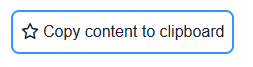

# Overview

The clipboard copy button is a component built with the react-copy-to-clipboard library, allowing users to quickly copy a specific piece of text to their clipboard. When clicked, it performs the copy action and displayes a confirmation message.

# Clipboard copy button

# QodlySource

| Name        | Type   | Required | Description                                                                 |
| ----------- | ------ | -------- | --------------------------------------------------------------------------- |
| Qodlysource | string | Yes      | Will contain the text content that will be copied to clipboard by the user. |

# Properties

| Name          | Type   | Default                   | Description                                                                                                                        |
| ------------- | ------ | ------------------------- | ---------------------------------------------------------------------------------------------------------------------------------- |
| Label         | String | Copy content to clipboard | The label that will be displayed within the button                                                                                 |
| Icon position | String | left                      | The position of the download's button's icon according to the label. The proposed options are: top, bottom, left, right, or hidden |
